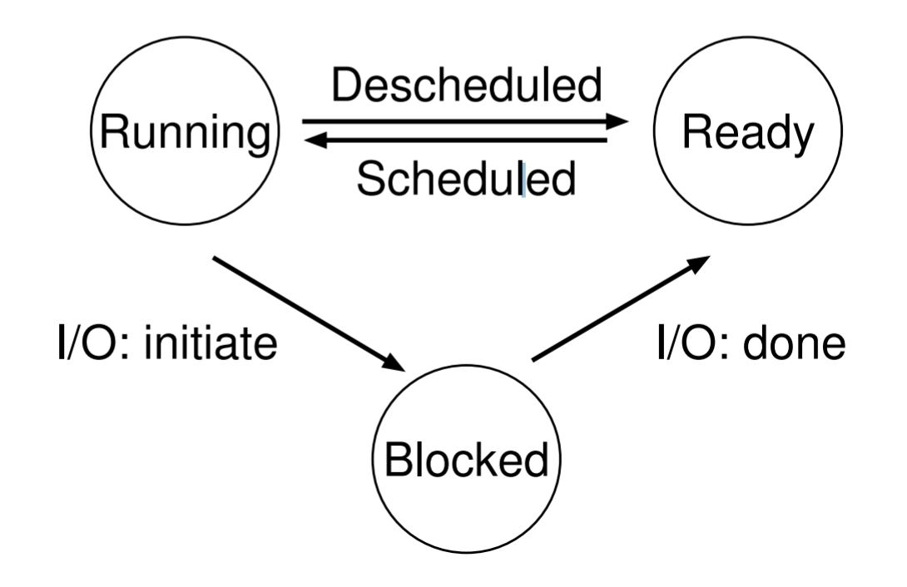
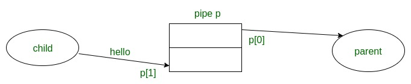

# Understanding the C Memory Model and Multi-Processing

## Processes and Memory Models
One fundamental feature of modern operating systems is the **Process** abstraction.

A process a running program.  Loaded from disk onto memory, a process
is the execution of a set of instruction, and holds a memory address space,
**register** values, and other information needed to run, such as execution **threads** and metadata. Before we get deeper into process details and how to work with them in C, consider this diagram of the C memory model.  


A program's memory model is the layout and discription any of memory usage, and likewise allows the compiler to perform code optimizations to boost runtime performance.


The main components of the C memory model are:
 - The **Stack**
 - The **Heap**
 - The **Data** section
 - The **Text** Section

### Data and Text Sections
The Data section contains global and static data and variables
associated with the program, and the text section is the written code itself.  

Both are loaded from the executable file on disk.  The Data section can be
broken down further into uninitialized and initialized segments, where
values in the Uninitialized section are set to 0 before the execution
of the program, but for now this distinction is unimportant.
  
### The Stack and the Heap
These sections are not loaded from disk, but rather represent segments in
memory that can grow and shrink as the process runs and uses memory.
The stack is a dynamically sized region in memory that grows from the
top of the memory address space downward, and contains local variables,
and information when functions are called, such as deep recursive calls.

The heap is a dynamic memory segment that grows from the bottom up, and
is managed by the functions **malloc, calloc, realloc, and free** to
request and give up memory by the program.  Heap data is useful for 
variable sized data, and for creating structures that need to exits
beyond the scope of the functions they are defined.

In essence, the stack is for local and more temporary variables/data,
while the heap is for longer lasting and variable sized data that is 
passed around functions in the program lifetime.

If the stack and heap memory address pointers meet, then the program is
effectively out of memory.

## A C Program with Stack and Heap Memory
```c
#include <stdio.h>

int global; //global variable stored in the uninitialized Data section
int glogal2 = 15; //initialized global variable stored in Data section

int main(int argc, char** argv){

	static int uninitStatic;  //static uninitialized variable stored in the uninitialized Data section

	int stackVar = 10;	//Stack variable

	char* heapData = malloc(10 * sizeof(char)); //a pointer to the start of a memory segment 
							//on the heap able to hold 10 char values
							//NOTE: malloc does not initialize the data,
							//whereas calloc initialized each block to zero.
							//Otherwise malloc and calloc do the same thing.
    
	free(heapData);  //returns (frees) the memory used by the heapData variable for future use

    return 0;
}
```

Here is a simple C program that utilized the various parts of the C memory model. Although the program does not do much of anything (in fact global variable are an anti-pattern),
it nonetheless displays how the stack, heap, and data sections are used when writing a C program.


##  Virtualization and Running Multiple Processes

Another key feature of operating systems is the ability to create multiple processes and seeming execute them at the same time.  This ability is a result of cpu and memory **virtualization**.  The details and complexities of virtualization are beyond the scope of this instructional, but an OS can create the illusion of running multiple processes at once with a technique called **time sharing**.  The OS simple runs one process, stops it, runs another process, and continues for each process.  The mechanism for switching processes is called **context switching**, and the OS decides to switch processes through a **scheduling policy**, which uses performance metrics, historical data, and workload information to make these decisions. Therefore, a process can be in a **running** state, or a **ready** state.
A process can also be **blocked** if it performs a task that makes it not ready to run until a future event occurs. 

 An example is when a process asks the disk for I/O.  These transitions look something like this:


```c
//the structure of a process in the xv6 OS. Includes register context and state
struct process {
	char* mem;		//start of process memory
	uint size;		//bottom of process memory
	char* kstack;   	//bottom of the kernel stack for this process
	enum proc_state state 	//process state
	int pid;		//Process ID
	struct proc* parent;	//parent process
	void* chan;		//If !zero, sleeping on chan
	int killed;		//if !zero, process killed
	struct file* ofile[NOFILE]; //Open files
	struct inode *cwd;	//current directory
	struct context context;	//switch here to run process
	struct trapframe* ft;	//trap frame for the current interrupt
}
```
# The C Process API

C provides system calls and function wrappers to create processes.  
Specifically, these system calls are
`fork()`, `exec()`, and `wait().`
When combined, these system calls can be used to run concurrent programs and
reap the benefits of multicore processors and parallelized systems.

## The `fork()` System Call
Simply put, calling `fork()` creates a new process. 
More specifically, calling `fork()` copies the current process and creates a new **child** process.
The child process will then execute immediately from where it was called in the **parent** process.

Consider this c code demonstrating `fork()`
```c
#include <unistd.h>
#include <sys/types.h>
#include <sys/wait.h>
#include <stdio.h>

int
main(int _ac, char* _av[])
{

    int cpid;	//child process ID

    printf("Before\n");

    if ((cpid = fork())) {
	//this is the parent process running

        printf("During\n");

        int st;
        waitpid(cpid, &st, 0);	//wait for the child process to finish running

        printf("After\n");
    }
    else {
	//this is the child process running
        execlp("echo", "echo", "In", "subprocess", NULL);
        printf("Never get here.\n");
    }

    return 0;
}
```
We introduced `wait()` and `exec()` in this example, but don't worry if they don't make sense at the moment.
We'll explain them shortly.  
For now focus on the syntax of `fork()`.

We define an integer variable `cpid` above to hold the return value of `fork()` when well all it below in the `if` statement. 
Remember, `fork()` creates two another process, therefore it will return two values, one for each process.  The return value
in the parent process causes the program to execute the `true` portion of the `if` statement, and the return value in the 
child process causes the program to execute the `false` portion of the `if` statement, therefore we can be sure our two
processes are running different blocks of code. 

An interesting effect of running different processes is **non-determinism**.  The cpu scheduler
as described above chooses which process to run at some moment in time, so we can't be sure which
process will run first and which will run later.

## The `wait()` System Call

In certain situation, if may be useful to wait for a child process to finish running before we continue executing parent-process code.  This is especially true if we have many child processes
running that take a long time to finish.  We don't want to use the results of child-process work in a parent process if those children are not complete.  

`wait()` solves this problem for us. `c` provides a wrapper function called `waitpid()` that
suspends the execution of the current process and waits for the given child process to terminate.
Specifically, `waitpid()` takes in the child-process ID to wait for, which can be obtained from the `fork()` system call.

## The `exec()` System Call
Say you want to run a program that is different from the current calling program. `exec()`, and a corresponding `c` wrapper function helps do just this.  In the above example, the program calls `execlp()`, which in turn call the program `echo` with the arguments `"echo", "In", "subprocess", NULL`.
In the example, `echo` is a program to simple print out its arguments to the terminal.

## The `pipe()` System Call
`pipe()` creates a one-way channel for data to pass between two processes.  That is, a pipe enables interprocess communication.  A pipe has a read 'end' and a write 'end', and the kernel buffers data written to the write end until it is read from the read end of the pipe.

# Putting it all Together - A Case Study with a Unix Shell

Take a look at the code of this [Unix style Shell](https://github.com/dmuller189/UnixShell), and specifically the nush.c file in the directory.  This file implements the basic feature of a Unix shell by using the `fork()`, `wait()`, and `exex()` system call and C wrapper functions.

The shell implements these following operators:
 - Redirect input `<`  e.g. `$sort < foo.txt`
 - Redirect outpu `>` e.g. `$sort foo.txt > output.txt`
 - Pipe `|` e.g. `$sort foo.txt | uniq` (redirects left output into right input)
 - Background `&` e.g. `$sleep 10 &`
 - And `&&` e.g. `$true && echo one`
 - Or `||` e.g. `$true || echo one`
 - simple commands `$command arg1 arg2...`
 	 - `$echo one two`
	 - `$cat foo.txt`
	 - `$pwd`
	 - `$sort foo2.txt`
	 - ...etc
 
 Learn more about them [here](https://unix.meta.stackexchange.com/questions/3177/canonical-question-about-shell-operators)


### Using `fork()` and `exec()` to Run a Simple Shell Command
First let's see how a simple command is executed using `fork()` and `exec()`.
Here's the important part of the function that demonstrates the forking we want to see.
The function argument is a pointer to an abstract syntax tree that represents the user's command, but don't worry about those details.

```c
int simpleCommand(ast* tree) {
	
char* cmd = tree->cmd->func; //gets command/program name to exec
    int cpid;	//child process id

    if((cpid = fork())) {
        //parent process
        int st;
        waitpid(cpid, &st,0);	//waits for child process to run

    } else {
        //child process
        return  execvp(cmd, tree->cmd->args);	//uses exec() to run the program specified by the user
        exit(-1);
    }
    return 0; 
}
```
And that's it for a simple one line command without any fancy shell operators.
The user enters into the shell a command to run, the program forks, execs in the child with the user's input, and the parent waits on the child.


### Using `fork()` to Run a Program in the Background

Now Let's focus on executing a command in the background.  Conceptually, the background shell operator does what it says; it runs a process in the background and allows the user to continue using the shell to execute more commands. 
 ```c
 int backgroundCommand(ast* tree) { 
    int cpid;

    if((cpid = fork())) {
    //parent         
		return 0;	
    } else {
    //child
   	execTree(tree->left);
    _exit(0);

    }
    return 0;
}
```
  Notice how the functions creates the illusion of running a process in the background by simply forking, and then executing the command in the child process.  The `execTree()` function does this for us when in a child process.  It's important that we don't wait in the parent right away, or else that would defeat the purpose of running in the background.  
  If you're curious, a more advanced implementation would eventually wait at some point in order to avoid zombie processes.

Let's take more complicated example.
### Using `fork()`s to Pipe Input and Output


As a mental model, a pipe connects two processes, and makes the standard output of one process the standard input of the other process.

Here's what the code looks like for implementing a pipe shell operator:

```c
int pipeCommand(ast* tree) {
    
	int cpid;		//first child process
	int cpid2;		//second child process
	int fdrs[2];	//file descriptors to change standard in/out
	//fdrs[0] for reading
	//fdrs[1] for writing

	if(cpid = fork()) {
		//parent
		waitpid(cpid,0,0);
	} else {
		//child
		pipe(fdrs);	//open a pipe 
		if(cpid2 = fork()) {
			//child/parent
			dup2(fdrs[0], 0);	//hook pipe to stadnard input
			close(fdrs[1]);		//close other side of pipe
			execTree(tree->right);	//execute command to the right of the pipe operator
			waitpid(cpid2, 0, 0);
		} else {
			//child/child
			dup2(fdrs[1], 1);	//hooks pipe to stdout
			close(fdrs[0]);		//close other side of pipe
			execTree(tree->left); // execute command to left of pipe operator
		}
	}
}
```
This certainly looks more advanced, as we are calling `fork()` inside of an outer `fork()`, which leaves us with four total processes.  Here's the logic:

Pipe: `$command1 | command 2`
 - fork
 - in child:
	- pipe syscall
	- fork
 	- in child/child: hook pipe to stdout, close other side
 	- in child/child: execute command1 (r)
 	- in child/parent: hook pipe to stdin, close other side
 	- in child/parent: execute command2 (r)
 	- in child/parent: wait on child/child
- in parent: wait on child

# Further Reading and Bibliography
- Arpaci-Dusseau, Remzi H., and Andrea C. Arpaci-Dusseau. Operating Systems: Three Easy Pieces. 1.00 ed., Arpaci-Dusseau Books, 2018.

- Bryant, Randal E., and David R. O'Hallaron. Computer Systems: a Programmer's Perspective. Pearson, 2019.

- Kangralkar, Narendra. “Memory Layout of C Programs.” Geeksforkeeks.org, www.geeksforgeeks.org/memory-layout-of-c-program/.

- Patel, Kadam. “Non-Blocking I/O with Pipes in C.” Geeksforkeeks.org, www.geeksforgeeks.org/non-blocking-io-with-pipes-in-c/.
~~~
NOTE:  All code given was written and executed on the Debian 10 Linux distro, and will not work on Windows.